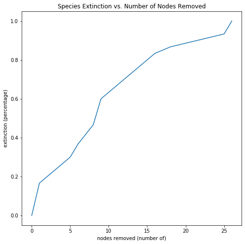

# Analyzing Food Webs through Redundant and Functional Relationships

by Elias Gabriel and Shirin Kuppusamy

## Abstract:
In this paper, we replicate the analysis and experiment done by S. Allesina, A. Bodini, and M. Pascual in their paper "Functional links and robustness in food webs".[1] The authors suggest that the degree of each species (node in a graph) can be broken into two separate categories: the number of important or functional connections, and the number of unimportant or redundant connections. In our analysis, we find similar results to the authors and conclude that redundant nodes can be removed from the food web without any harm to the robustness of the network or the species in it. On the contrary, functional connections are necessary for the survival of species. We also display that removing functional nodes has a greater impact on extinction than removing central nodes. 

## Question:
Based off of the categorizations presented in S.Allesina et. al's research, we ask the central question "How does the classification of functional and redundant relationships impact extiction when comapared to a model purely based off of degree centrality?"

## Methodology:
In order to compare the effects on extinction of highly connected species and highly functional nodes, we first experiment with the targeted removal of nodes with high degrees of centrality. In the context of our question, we are removing the species with the greatest number of predetor and prey relationships. We do this by sequentially removing the node with the highest degree. In each iteration, we also check for and remove all orphaned species, which are nodes in the graph that no longer have any neighbors.

Following that, we experiment with the targeted removal of functional nodes. We first identify which nodes are functional through the property of dominance. [We do not fully understand this concept, but are working towards a functional implementation.] We then identify and remove redudant nodes, which are nodes that are not functional. From the new subset of nodes, we iteratively remove functional and orphaned nodes.

Throughout our process, we use data collected from published papers on real world ecoystems.[2]

## Results

The results of the first part of our experiment are consistent with S. Allesina et. al's results. As expected, the number of extinctions increases as the number of central nodes removed increases. 

[The results of the second part of our experiment are expected to be similar to that above and will be in the same format (extinctions vs. number of functional nodes removed).]

## Interpretation
It is evident from the results that as the number of nodes removed increases the number of extinctions increases.

[Once we get results for the second part of our experiment, we will compare the the shapes of the two graphs to see which one has a greater effect on the number of extinctions. We expect that both graphs will increase, but that the graph plotting number of extinctions vs. number of functional nodes removed will have a steeper slope.]

## References
1.
  > "Functional links and robustness in food webs":
  > https://europepmc.org/backend/ptpmcrender.fcgi?accid=PMC2685419&blobtype=pdf,
  >
  > S. Allesina; A. Bodini; M. Pascual
  >
  > The authors state that the analysis of food networks is critical to understanding species extinction. In contrast to previous methodologies, which approach analysis by the removal of nodes (species) with the highest degree of predator/prey connections to other nodes, Allesina, Bodini, and Pascual propose that there are two types of connections in a given food web: redundant and functional. They experiment with their proposal by importing real-world food networks and analize the effect of random node removal vs. targeted removal of nodes with high degrees of function. They conclude that high degrees of centrality do not necessarily correlate to importance in an ecosystem, as past paper suggested. Rather, the number of functional connections a species has is a better indicator of its importance and role in a food network.
  >
2.
  > "Local trophodynamics and the interaction of marine mammals and fisheries in the Benguela ecosystem":
  > https://besjournals.onlinelibrary.wiley.com/doi/epdf/10.1046/j.1365-2656.1998.00224.x
  >
  > P. Yodzis, Journal of Animal Ecology (1998): 635-58.
