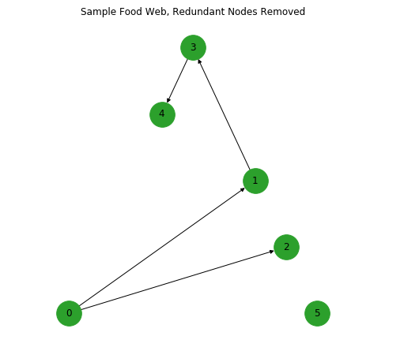

# Analyzing Food Webs through Redundant and Functional Relationships

by Elias Gabriel and Shirin Kuppusamy

## Abstract:
In this paper, we attempt to replicate the analysis and experiment done by S. Allesina, A. Bodini, and M. Pascual in their paper "Functional links and robustness in food webs".[1] The authors suggest that the degree of each species (node in a graph) can be broken into two separate categories: the number of important or functional connections, and the number of unimportant or redundant connections. The authors conclude that redundant edges can be removed from an ecological food web without any harm to the robustness of the network or the species in it. On the contrary, functional connections are necessary for the survival of species. Allesina et. al also display that removing functional nodes has a greater impact on extinction than removing central nodes.

Our results replicate the behavior suggested by the authors, but only until a crossover point. After which, the removal of nodes with higher degrees has a larger impact. Related, our algorithm implementation identifies a much smaller segment of functional edges than that identified by the authors for the given dataset.

## Question:
Based off of the categorizations presented in S.Allesina et. al's research, we ask the central question "How does the classification of functional and redundant relationships impact extiction when comapared to a model purely based off of degree centrality?"

## Methodology:
Before experimenting with various methods of species targeting, we import data from published papers on real world ecosystems. Specifically, we focus on a dataset provided in [1] on the Benguela acquatic food system[2].

In order to compare the effects of highly connected species and highly functional nodes on extinction, we first experiment with the targeted removal of nodes with high degrees of centrality. In the context of our question, we remove the species with the greatest number of predetor and prey relationships. We do this by sequentially removing the node with the highest degree. In each iteration, we also check for and remove all orphaned species, which are nodes in the graph that no longer have any predecessors. 

Following that, we experiment with the targeted removal of functional edges. We first identify which edges are functional through the property of immediate dominance. In the context of an ecological system, a predetor is dominated by a prey species if energy from a system's producers must pass through that species in order to get to the predetor. Immediate dominance is an extension of that concept which states that certain prey are immediatly dominating if they do not also immediatly dominate another prey species. 

We implement an algorithm proposed in the Christensen paper[3], and then use it to identify and remove redudant edges, which are edges that are not functional. From the new subset of connections, we iteratively remove nodes with the highest degree of functional connections. We also simulate secondary extinction events, which are events caused by the sudden lack of prey for a predeter, by removing nodes with no predecessors at every iteration.

A runnable version of the commented code and explanatory text supporting our experiment is accessible via Binder: 

A static version of our notebook is on Jupyter NBViewer [here](https://nbviewer.jupyter.org/github/thearchitector/foodweb/blob/master/code/foodweb.ipynb).

## Results

The above graph is a network of the Benguela Food Web. Nodes 1 and 2 are roots, which do not have prey connections to anything else.

The results of the first part of our experiment are consistent with S. Allesina et. al's results. As expected, the percentage of extinctions increases as the number of central nodes removed increases. 

We use a sample food web provided in the paper to test the identification of redundant and functional nodes.

This is the sample food web altered to remove all redundant nodes. The results are inconsistent with the expected results as the graph is missing the 2-5 and 3-5 connections. 

This is the Benguela Food Web with the redundant edges removed. The results are also inconsistent with the expected results as there are only 48 functional connections remaining, while the paper states that there should be 147.

The blue line is the percent of extinctions based on removal of nodes by centrality while the orange line is based on removal of functional nodes. As expected, the rate of increase in extinctions per functional node removed is much higher than the rate per central node removed for a segment of the graph. However, past the crossover point, the effect of removing a central node becomes larger than that of removing a functional node, contrasting to what the paper suggests.

## Interpretation
It is evident from the results that as the number of nodes removed increases the number of extinctions increases as well. However, the influence of removing functional nodes is unclear. The number of functional nodes we identified in both the sample graph and the Benguela food web did not match with that documented by the paper. Similarly, although our graph exhibits the predicted trend for a portion of functional nodes, the effect of removing a central node outweighs that of removing a functional node after the crossover point. Thus, we suggest that this discrepency is due to there being fewer functional nodes than anticipated, most likely as a result of lacking detail in the sources or misconception regarding the algorithm presented. 

## Appendix
Our next steps include contacting the original authors to identify the differences between our implementations of the algorithm. We will also present our varying results and intend to search for other implementations of similar algorithms.

## References
1.
  > "Functional links and robustness in food webs":
  > https://europepmc.org/backend/ptpmcrender.fcgi?accid=PMC2685419&blobtype=pdf,
  >
  > S. Allesina; A. Bodini; M. Pascual
  >
  > The authors state that the analysis of food networks is critical to understanding species extinction. In contrast to previous methodologies, which approach analysis by the removal of nodes (species) with the highest degree of predator/prey connections to other nodes, Allesina, Bodini, and Pascual propose that there are two types of connections in a given food web: redundant and functional. They experiment with their proposal by importing real-world food networks and analize the effect of random node removal vs. targeted removal of nodes with high degrees of function. They conclude that high degrees of centrality do not necessarily correlate to importance in an ecosystem, as past paper suggested. Rather, the number of functional connections a species has is a better indicator of its importance and role in a food network.
  >
2.
  > "Local trophodynamics and the interaction of marine mammals and fisheries in the Benguela ecosystem":
  > https://besjournals.onlinelibrary.wiley.com/doi/epdf/10.1046/j.1365-2656.1998.00224.x
  >
  > P. Yodzis, Journal of Animal Ecology (1998): 635-58.

3.
  > ":
  > http://www.cs.au.dk/~gerth/advising/thesis/henrik-knakkegaard-christensen.pdf
  >
  > H. K. Christensen, Supervisor: G. S Brodal
