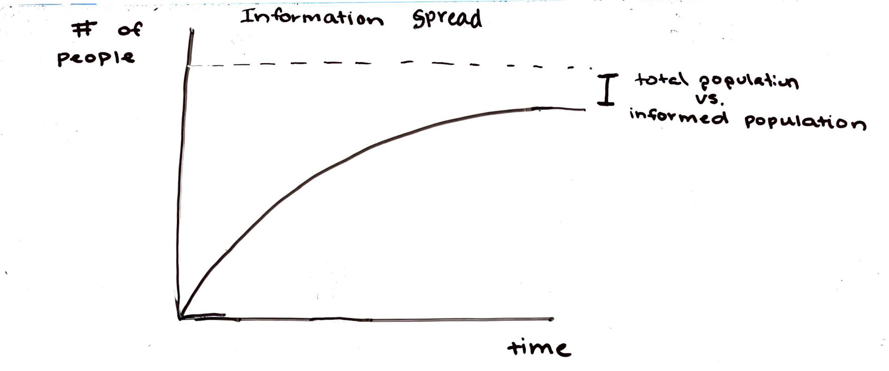

# Analyzing Information Spread Through Varying Network Structures
by Elias Gabriel, Shirin Kuppusamy

## Overview
We plan to investigate the spread and distribution of information through communities of people. Models that we have looked at suggest that the number of people who know about a given piece of information depends upon factors such as:
1. The hook (intrigue a story prompts at a quick glance)
2. Understanability (formal vs. causal writing, Layman's terms)
3. Personal impact (how relevant or attractive a piece of news is on a specific individual)
4. Alignment with societal and personal values

We plan to replicate the model described above. Specifically, we want to try and reproduce the information spread of Marylin Monroe's death (pp. 11).  In addition we hope to experiment with other avenues of analysis, including:

1. Reverse-engineering the model in order to create a piece of infromtion that spreads virally
2. How varying edge distances affects information spread
3. How the interplay between many sources of information in the same network affects overall (and specifc) spread

We plan on making use of the libraries with have used in class, like NetworkX, Numpy and MatPlotLib, to create and manipulate graphs. We may also may use the ModSimPy library, as there seem to be similarities between information spread and the SIR model.

Our biggest cause for concern is avoiding overscoping the project and our extensions for the given amount of time. Additoonally, although data is readily avaliable, we are unsure how easily that data can be adapted to fit our simulation.

## References
Characterizing information importance and the effect on the spread in various graph topologies 

J. Flamino, A. Norman, M. Wyatt, The UMAP Journal 37.2: 121–144; https://arxiv.org/abs/1706.07405 

> Flamino, Norman and Wyatt investigate the current methods and theories behind information communication and introduce a more complicated model for the spread and distribution of information through communities of people. They show that real-world information spreads by many factors, but among the most important are its relevance / “importance” and the structure / connectedness of the community network through which it spreads. They compare and validate the results of their model to real-collected publicity data and conclude with an explanation of further uses and implementations, suggesting the ability to “strategically spread an information item to the furthest bounds.” 

## Anticipated Results

Regardless of which extension we carry out, the key result we are looking for the is the percentage of people that are aware of a piece of information out of the total population in the network. This measure will determine the success of the information we create if we pursue the first extension we discussed. In the second extension discussed, this measure determines how changing the edge distances affects the total success rate. In the third extension discussed, comparing this measure for both sources of information can present useful results about the interplay of the spread of multiple information sources.

## Next Steps
1. Get input in class
2. Schedule meeting times for the duration of the project
3. Replicate model together
 * Individually read throug entire paper and then discuss confusions
 * Each partner individually tries to find new sources of information
 * Break down the mathematical model
 * Figure out implementation (maybe using a big screen)
 * Compare implementation results to paper
 * Add in extensions
4. Analyze results and come to conclusions
5. Write report
6. Submit report
